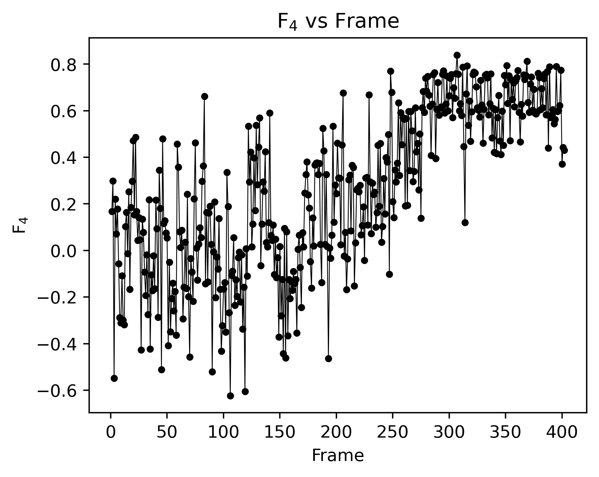
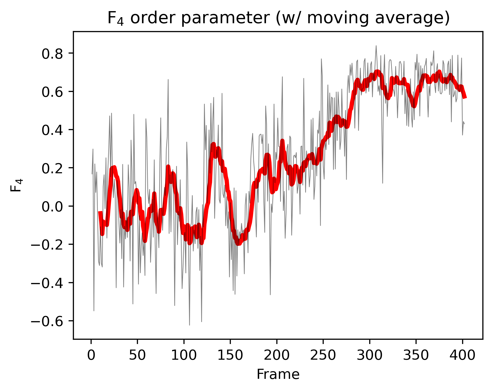

# pyf4
::A Python script to calculate and visualize the $F_4$ order parameter from GROMACS trajectory::

----

This repository contains a Jupyter Notebook (`f4.ipynb`) that calculates the $F_4$ order parameter from a trajectory of water molecules and plots the $F_4$ values over the trajectory frames.

## Introduction

The $F_4$ order parameter, also known as the tetrahedral order parameter, is a measure of the degree of tetrahedrality in the arrangement of water molecules. It quantifies the <u> local structure and ordering of water molecules in a given system </u>, which is a fundamental characteristic of water in various phases, including _liquid water, ice, and clathrate hydrates_.

The $F_4$ order parameter is defined as:

$F_4 = \langle \cos 3\varphi \rangle $

where $\varphi$ is the torsion angle between two hydrogen-bonded water molecules, and the angular brackets denote an ensemble average.

The torsion angle $\varphi$ is calculated by considering the relative orientations of the water molecules. It is defined as the angle between the planes formed by the oxygen atoms of the two water molecules and their respective hydrogen atoms involved in the hydrogen bond. $\rightarrow$ Check the source code :) 

The value of $F_4$ ranges from -0.1 to 0.7 (generally), with the following interpretations:
- $F_4 = 0.7$: Complete crystalline hydrate structure
- $F_4 = 0$: Liquid water
- $F_4 = -0.4$: Complete ice structure

By calculating and analyzing the $F_4$ order parameter, we can gain insights into the local structure and ordering of water molecules in different systems, such as liquid water, ice, and clathrate hydrates. It provides a quantitative measure of the degree of tetrahedrality and can be used to characterize the phase behavior and structural properties of water-containing systems.

## Showcases

#### **1. $F_4$ vs. Frame (raw)** 
|  |
|:---:|

#### **2. $F_4$ vs. Frame (w/ rolling avg.)**
|  |
|:---:|

## Features

- Calculates the $F_4$ order parameter for each frame in a water molecule trajectory
- Plots the raw $F_4$ values over the trajectory frames
- Computes and plots a moving average of the $F_4$ values for smoother visualization

## How to Use
0. git clone to your local computer. Then, the source Jupyter file and source examples would be downloaded.
    ```shell
    git clone https://github.com/wjgoarxiv/pyf4.git
    ```
    
2. Open [`f4.ipynb`](f4.ipynb) in your Jupyter environment.
3. Place your **water molecule trajectory file** (in example, the [`prod_trjconv_SOL.gro`](source_trj/prod_trjconv_SOL.gro) file was used) in the [`source_trj`](source_trj) directory.
4. Now, by running _**1. Execute this if the `.gro` file has not been segregated**_ part to segregate the trajectory GRO file into separated GRO files (per frame). Check the [`./segregated/`](segregated) folder. There segregated `frame_*.gro` files are located.
5. Run the _**2. Run and find F4 values per frame**_ part to calculate $F_4$ order parameter per frame. It looks like this:
    ```CSV
    1,0.16803680968136386
    2,0.298460690279075
    3,-0.548265463039205
    4,0.2206492688636402
    5,0.07142864914968847
    6,0.17844661437250695
    7,-0.05736835645757173
    8,-0.28873006258953005
    9,-0.3107745768183056
    ...
    ```
6. Also, check the generated CSV file entitled [`frame_f4_values`](frame_f4_values).
7. Now, run _**3. Plot `F4 - frame` graph**_ part to generate plots. You can check [(1) raw plot](f4_vs_frame_raw.png) and [(2) rolling average plot](f4_vs_frame_rolling.png). It's highly recommended to use a rolling average plot for your research; since the raw data might export the outlier values outside the allowed $F_4$ values of _liquid water, ice, or hydrates_.

## References

1. [GRADE: A code to determine clathrate hydrate structures](https://doi.org/10.1016/j.cpc.2019.06.004)

2. [Computer Simulation of the Crystal Growth and Dissolution of Natural Gas Hydrates](https://doi.org/10.1111/j.1749-6632.1994.tb38833.x)

## License

This project is licensed under the [MIT License](LICENSE).

-------

Feel free to explore the code and adapt it to your specific needs. If you have any questions or suggestions, please open an issue or contact me.

Happy simulations! :-)
